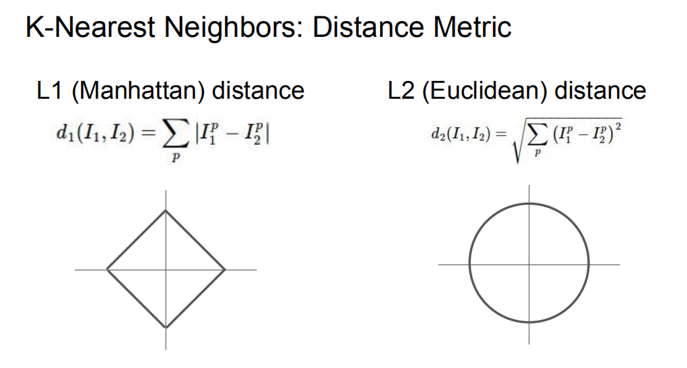

# 2021/9/18

## L1 距离和 L2 距离图像及公式

其中 $I_1$ 和 $I_2$ 是 $p$ 维向量，例如 $ I_1 = [0, 1], I_2 = [1, 0]$ , 则 $ p=2 $.  
$L_1$ $distance$:$$d_1(I_1,I_2) = |I_1^1 - I_2^1| + |I_1^2 - I_2^2| = |0 - 1| + |1 - 0| = 2$$
$L_2$ $distance$:$$d_2(I_1,I_2) =\sqrt{(I_1^1 - I_2^1)^2 + (I_1^2 - I_2^2)^2}=\sqrt{(0 - 1)^2 + (1 - 0)^2}=\sqrt2$$.
&emsp;&emsp;解释一下为什么 $L_1$ 距离图像为什么为菱形，而 $L_2$ 距离图像为圆  
我们以二维空间为例 :  
&emsp;&emsp; 对于 $L_1$，它计算的是第一维差的绝对值加上第二维差的绝对值，可以想象成直角三角形的两条直角边的长度和。对于 $L_2$，他计算的是第一维差的平方加上第二维差的平方再求和，然和开根。由勾股，可以想象成直角三角形的斜边长。当距离一定时，若以 $I_1$ 为原点，则 $I_2$ 所有可能的点即为上述图像。

## Batch Normalization，BN 算法

## L1-norm 和 L2-norm
